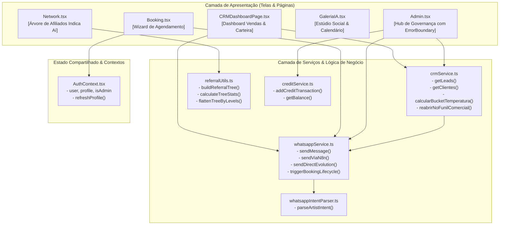

# Diagrama C4 — Nível 3: Componentes Internos da SPA

> Gerado pelo Reversa Architect em 2026-10-03 (Nível: Detalhado)
> Escala de Confiança: 🟢 CONFIRMADO (Código)

---

## 1. Decomposição de Componentes da Single Page Application (SPA)

