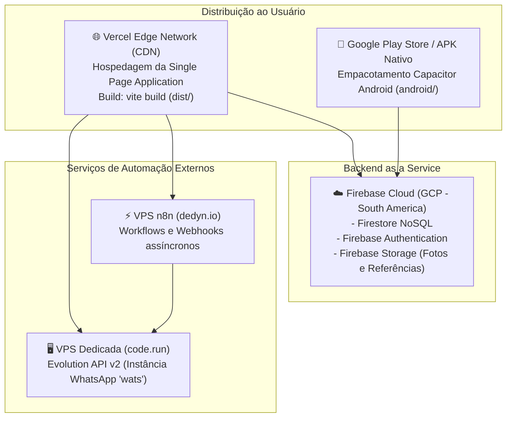

# Infraestrutura & Deployment — SuperApp Somos 1 / Indica Aí

> Gerado pelo Reversa Architect em 2026-10-03 (Nível: Detalhado)
> Escala de Confiança: 🟢 CONFIRMADO (Configurações e Scripts)

---

## 1. Topologia de Implantação e Hospedagem

---

## 2. Variáveis de Ambiente e Chaves de Integração

| Variável | Escopo | Descrição |
|---|---|---|
| `VITE_FIREBASE_API_KEY` | Frontend | Chave pública do SDK Firebase |
| `VITE_FIREBASE_PROJECT_ID` | Frontend | `memorizeai-7b8fd` |
| `VITE_EVOLUTION_API_KEY` | Frontend / Admin | Chave de autorização da Evolution API |
| `DEFAULT_N8N_WEBHOOK` | Backend / Service | `https://www.marcos9vinci.dedyn.io/webhook/indica-automacao` |
| `EVOLUTION_BASE_URL` | Config / Studio | `https://p01--evolution--6n2dx6dsdlsf.code.run` |

---

## 3. Pipeline de Build & Validação
- **Comando de Build Web:** `npm run build` (compilação TypeScript + Vite bundle).
- **Sincronização Mobile:** `npx cap sync android` (copia assets de `dist/` para a pasta nativa Android).
- **Compilação Android:** Gradle wrapper (`./gradlew assembleRelease`).
