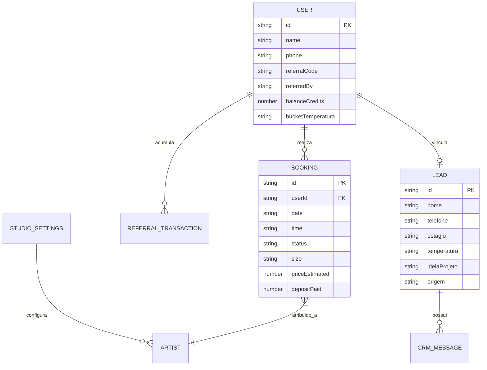

# Modelo de Domínio & Regras de Negócio — Somos 1 / Indica Aí

> Gerado pelo **Reversa Architect** em 03/10/2026.

## 1. Diagrama de Relacionamento de Entidades (ERD Lógico)

## 2. Dicionário de Coleções do Firestore

| Coleção | Papel no Sistema | Document ID Padrão |
|---|---|---|
| `users` | Cadastro de clientes, créditos e temperatura | Auth UID ou Auto-ID |
| `bookings` | Sessões marcadas e histórico da agenda | Auto-ID |
| `leads` | Cards do Funil Comercial de Vendas | Auto-ID ou `booking_{id}` |
| `contatos_ignorados` | Blacklist de contatos ignorados no CRM | Telefone normalizado |
| `studio_settings` | Configurações globais e automação Evolution | Documento fixo `main` |
| `referral_transactions` | Extrato de comissões e pontos gerados | Auto-ID |
