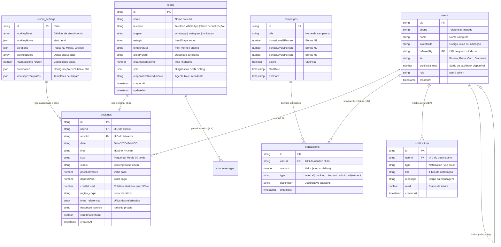

# Diagrama Entidade-Relacionamento (ERD) — Firestore

> Gerado pelo Reversa Architect em 2026-10-03 (Nível: Detalhado)
> Escala de Confiança: 🟢 CONFIRMADO (Coleções Firestore)

---

## 1. Modelo de Dados Entidade-Relacionamento

O banco de dados NoSQL Firestore (`memorizeai-7b8fd`) é organizado pelas seguintes coleções principais:

