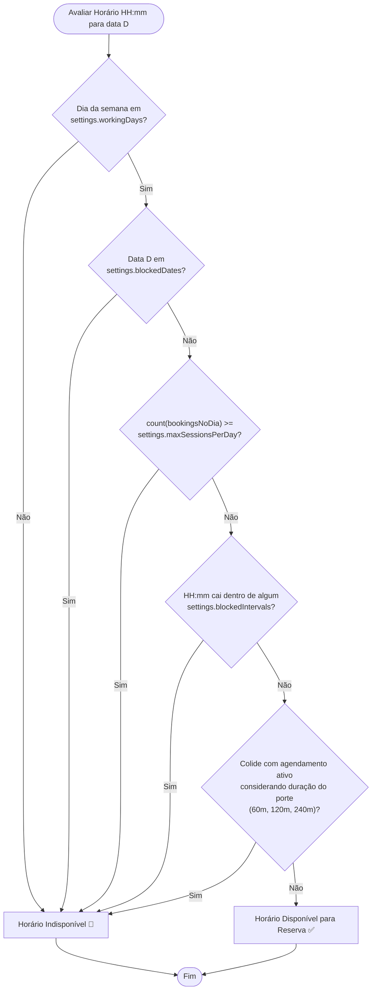

# Fluxograma: Validação de Slots & Capacidade de Agenda

> Gerado pelo Reversa Archaeologist em 2026-10-03 (Nível: Detalhado)
> Localização no código: `src/pages/Booking.tsx`, `src/types.ts` (`StudioSettings`)
> Escala de Confiança: 🟢 CONFIRMADO

---

## 1. Regras de Disponibilidade

Um horário só é ofertado como disponível para o cliente se passar por 5 filtros sucessivos:
1. **Dia da Semana:** Dia selecionado deve constar em `workingDays` (ex: 1 a 6 = Seg a Sáb).
2. **Datas Bloqueadas Globais:** Não pode estar na lista `blockedDates` (feriados, férias).
3. **Capacidade Diária Máxima:** Total de agendamentos no dia não pode exceder `maxSessionsPerDay` (padrão: 5).
4. **Intervalos Bloqueados Específicos:** O horário não pode colidir com nenhum registro em `blockedIntervals`.
5. **Colisão com Sessões Existentes:** A duração da tattoo (Pequena: 60m, Média: 120m, Grande: 240m) não pode invadir a janela de outra sessão já existente.

---

## 2. Fluxograma de Validação de Slot

