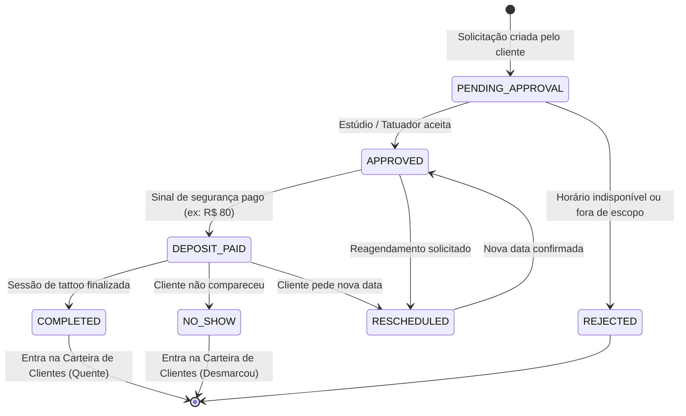
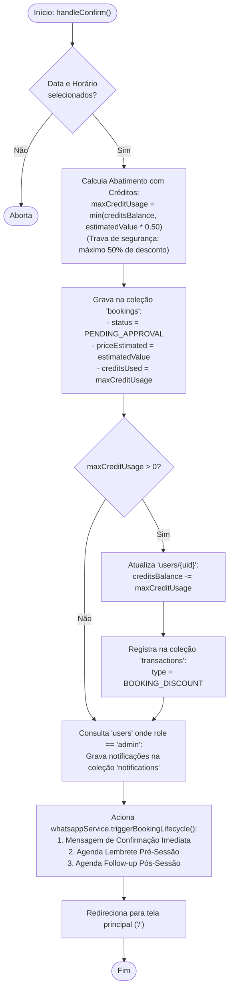

# Fluxograma — Agenda & Booking (Somos 1 / Indica Aí)

> Gerado pelo Reversa Archaeologist em 2026-10-03 (Nível: Detalhado)
> Escala de Confiança: 🟢 CONFIRMADO (Extraído diretamente de `src/pages/Booking.tsx`, `src/types.ts`)

---

## 1. Ciclo de Vida do Agendamento (Máquina de Estados)

---

## 2. Fluxograma da Ação: `handleConfirm` (Criação de Agendamento)

