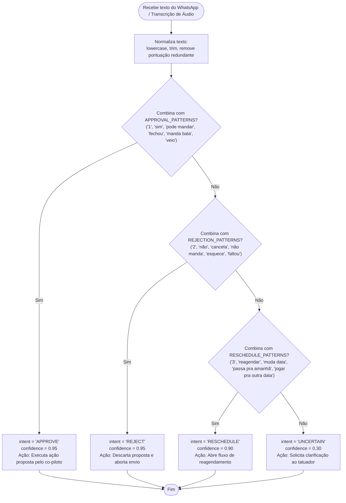

# Fluxograma: Processador de Intenções do WhatsApp (`whatsappIntentParser`)

> Gerado pelo Reversa Archaeologist em 2026-10-03 (Nível: Detalhado)
> Localização no código: `src/lib/whatsappIntentParser.ts` (linhas 1–206)
> Escala de Confiança: 🟢 CONFIRMADO

---

## 1. Assinatura e Intenções Reconhecidas

```typescript
type ArtistIntent = 'APPROVE' | 'REJECT' | 'RESCHEDULE' | 'UNCERTAIN';

function parseArtistIntent(rawText: string): ParsedIntentResult
```

---

## 2. Fluxograma de Reconhecimento


