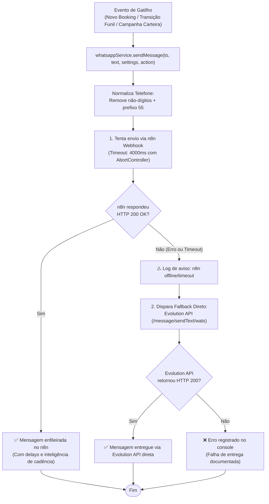
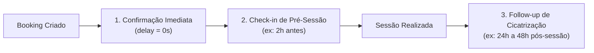

# Fluxograma — Automação WhatsApp & n8n (Somos 1 / Indica Aí)

> Gerado pelo Reversa Archaeologist em 2026-10-03 (Nível: Detalhado)
> Escala de Confiança: 🟢 CONFIRMADO (Extraído de `src/lib/whatsappService.ts`, `src/lib/whatsappBatchScanner.ts`)

---

## 1. Arquitetura de Disparo Resiliente de Mensageria

O envio de mensagens WhatsApp conta com redundância de canal duplo:
1. **Canal Primário:** Webhook n8n (`https://www.marcos9vinci.dedyn.io/webhook/indica-automacao`) com timeout rigoroso de 4.000 ms.
2. **Canal Secundário (Fallback Imediato):** Chamada direta à Evolution API (`https://p01--evolution--6n2dx6dsdlsf.code.run/message/sendText/wats`).

---

## 2. Pipeline Temporal de Ciclo de Vida do Agendamento

