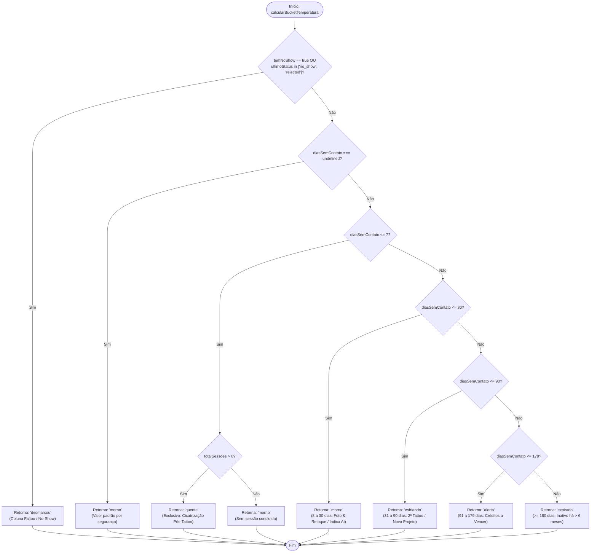

# Fluxograma da Função: `calcularBucketTemperatura`

> Gerado pelo Reversa Archaeologist em 2026-10-03 (Nível: Detalhado)
> Localização no código: `src/types/crm.ts` (linhas 172–196)
> Escala de Confiança: 🟢 CONFIRMADO

---

## 1. Assinatura da Função

```typescript
function calcularBucketTemperatura(
  diasSemContato: number | undefined,
  totalSessoes: number,
  ultimoStatus?: string,
  temNoShow?: boolean
): ClienteCarteiraTempStage
```

---

## 2. Fluxograma de Decisão



---

## 3. Regras de Negócio Críticas Documentadas

1. **Exclusividade do 'quente':**
   - O estado `quente` só é atribuído se `diasSemContato <= 7` **E** `totalSessoes > 0`. Clientes cadastrados sem sessão concluída nunca entram em `quente`.
2. **Prioridade de No-Show:**
   - Cancelamentos ou faltas (`no_show`, `rejected`) têm precedência absoluta sobre o cálculo temporal e enviam o cliente diretamente para o bucket `desmarcou`.
3. **Ponto de Corte de 180 Dias:**
   - O marco de 180 dias está estritamente atrelado à política de validade de comissões/créditos do motor do Indica Aí.
