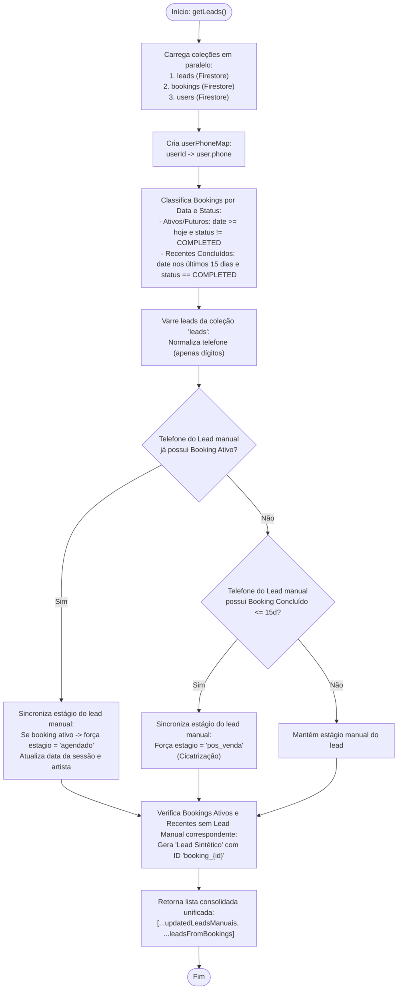

# Fluxograma da Reconciliação: `leads`, `bookings` e `users`

> Gerado pelo Reversa Archaeologist em 2026-10-03 (Nível: Detalhado)
> Localização no código: `src/lib/crmService.ts` (`getLeads` linhas 39–224, `getClientes` linhas 292–430)
> Escala de Confiança: 🟢 CONFIRMADO

---

## 1. Problema Resolvido pelo Algoritmo

O sistema armazena agendamentos na coleção `bookings`, usuários cadastrados na coleção `users` e leads manuais/prospects na coleção `leads`.
Para evitar duplicações entre a **Agenda Oficial** e o **Funil Comercial**, o `crmService` executa um algoritmo em memória de reconciliação cruzada usando como chave primária o telefone normalizado (`replace(/\D/g, '')`).

---

## 2. Fluxograma de Reconciliação do `getLeads()`



---

## 3. Isolamento e Regra de Ouro da Carteira

```
Clientes com sessões concluídas há mais de 15 dias são AUTOMATICAMENTE
omitidos do Funil Comercial e transferidos exclusivamente para a
CARTEIRA DE CLIENTES (Esteira de Temperatura), evitando poluição do kanban de vendas.
```
