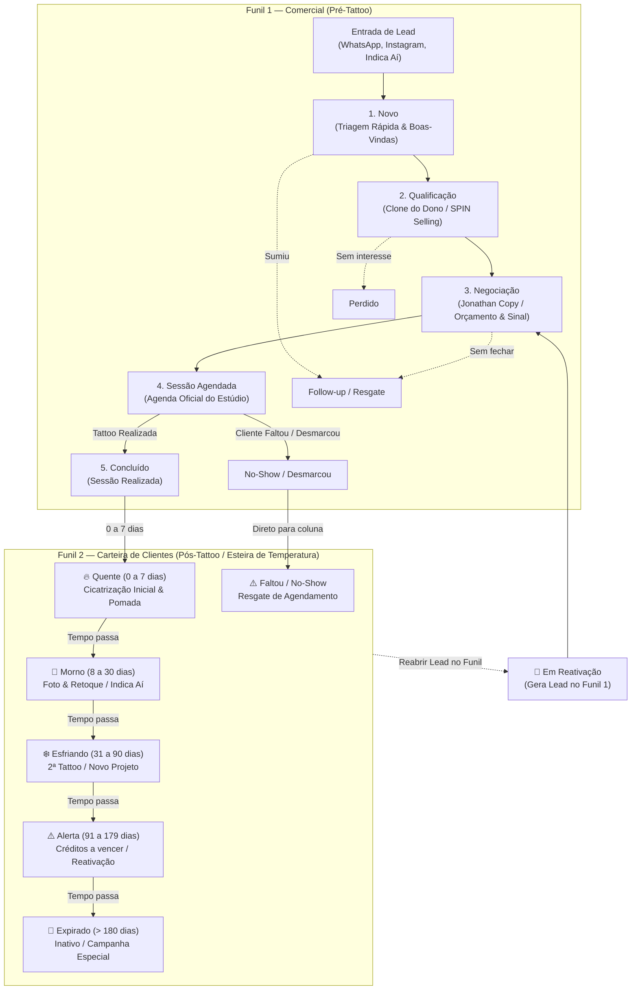

# Fluxograma — CRM & Funil Comercial (Somos 1 / Indica Aí)

> Gerado pelo Reversa Archaeologist em 2026-10-03 (Nível: Detalhado)
> Escala de Confiança: 🟢 CONFIRMADO (Extraído diretamente de `src/types/crm.ts`, `src/lib/crmService.ts`)

---

## 1. Visão Geral da Arquitetura de Duplo Funil

O sistema opera com uma esteira comercial bifurcada:
1. **Funil 1 — Comercial (Pré-Tattoo):** Focado em conversão de leads vindos de WhatsApp, Instagram ou Indica Aí até a realização da tattoo.
2. **Funil 2 — Carteira de Clientes (Pós-Tattoo):** Esteira de retenção e reengajamento baseada no tempo desde a última tattoo (`diasSemContato`).

---

## 2. Agentes de IA por Coluna do Funil Comercial

| Coluna | ID Agente | Papel & Tom de Voz | Origem / Framework |
|---|---|---|---|
| **Novo** | `agent_novo` | Recepção ágil (`casual_estudio`) | NAIA Onboarding & Triagem |
| **Qualificação** | `agent_qualificacao` | Qualificação SPIN/BANT (`consultivo_spin`) | Subagente 02 — Clone do Dono |
| **Negociação** | `agent_negociacao` | Apresentação de valor e sinal (`persuasivo_copy`) | Subagente 04 — Jonathan Copywriter |
| **Agendado** | `agent_agendado` | Confirmação e lembretes pré-sessão | Agenda Oficial / Evolution API |
| **Pós-Venda** | `agent_posvenda` | Acompanhamento de cicatrização (`acolhedor_posvenda`) | Subagente 06 — Juliana Cuidados |
| **Follow-up** | `agent_followup` | Reengajamento de contatos frios | NAIA Resgate |
