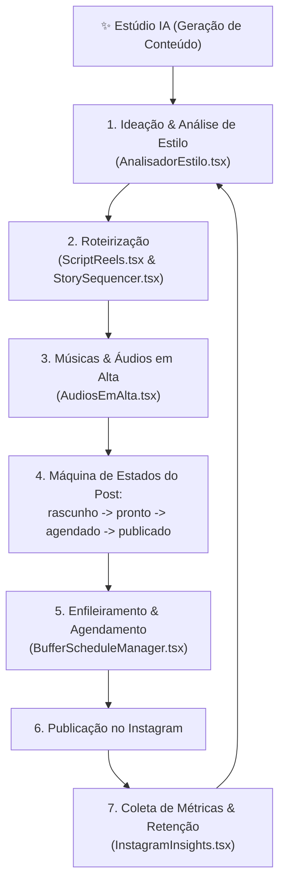

# Fluxograma — Galeria & Portfólio IA (Somos 1 / Indica Aí)

> Gerado pelo Reversa Archaeologist em 2026-10-03 (Nível: Detalhado)
> Escala de Confiança: 🟢 CONFIRMADO (Extraído de `src/pages/GaleriaIA.tsx`, `src/constants/galeria.ts`)

---

## 1. Visão Geral do Estúdio de Conteúdo IA

O módulo GaleriaIA atua como o hub de marketing, geração de mídia e presença digital para o estúdio:

---

## 2. Estados Operacionais do Post

| Status | Cor / Indicador | Significado |
|---|---|---|
| `rascunho` | Amarelo | Post em criação/edição visual |
| `pronto` | Azul | Aprovado pelo tatuador / estúdio |
| `agendado` | Índigo (pulsante) | Enfileirado no Buffer / Scheduler |
| `publicado` | Verde | Publicado com sucesso no feed/stories |
