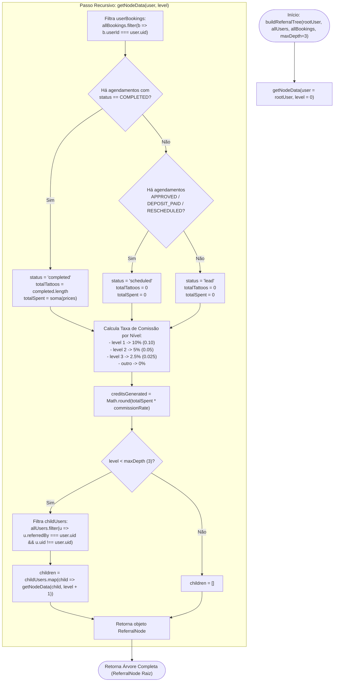

# Fluxograma da Função: `buildReferralTree`

> Gerado pelo Reversa Archaeologist em 2026-10-03 (Nível: Detalhado)
> Localização no código: `src/lib/referralUtils.ts` (linhas 26–80)
> Escala de Confiança: 🟢 CONFIRMADO

---

## 1. Assinatura da Função

```typescript
function buildReferralTree(
  rootUser: UserProfile,
  allUsers: UserProfile[],
  allBookings: Booking[] = [],
  maxDepth: number = 3
): ReferralNode
```

---

## 2. Fluxograma Recursivo



---

## 3. Comportamento e Detalhes Importantes

1. **Prevenção de Loops Infinitos:**
   - O filtro `u.uid !== user.uid` previne que um usuário que aponte para si mesmo como `referredBy` gere recursão infinita.
2. **Profundidade Fixada:**
   - O limite padrão `maxDepth = 3` isola o sistema de comissões aos 3 níveis comerciais permitidos pelas regras fiscais e de margem do estúdio.
3. **Arredondamento:**
   - Uso de `Math.round` na geração de créditos garante valores inteiros no saldo do cliente (`creditsBalance`).
