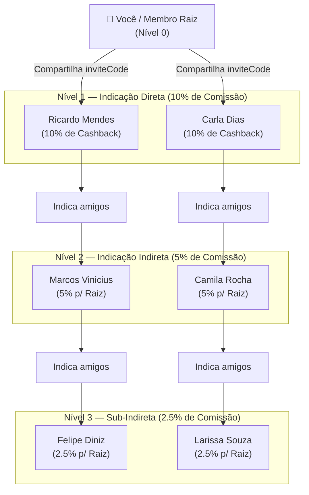

# Fluxograma — Motor de Afiliados Indica Aí (3 Níveis)

> Gerado pelo Reversa Archaeologist em 2026-10-03 (Nível: Detalhado)
> Escala de Confiança: 🟢 CONFIRMADO (Extraído diretamente de `src/lib/referralUtils.ts`, `src/pages/Network.tsx`)

---

## 1. Topologia da Rede e Regras de Comissionamento

O motor do Indica Aí estrutura uma rede em cascata unilevel de até 3 níveis de profundidade:

---

## 2. Ciclo de Vida do Indicado na Árvore

Cada pessoa na rede assume um dos 3 estados:
- **`lead`**: Cadastrou-se via código/link, mas ainda não agendou nem tatuou.
- **`scheduled`**: Possui agendamento com status `APPROVED`, `DEPOSIT_PAID` ou `RESCHEDULED`.
- **`completed`**: Possui pelo menos uma sessão com status `COMPLETED`. **Apenas este estado gera créditos financeiros para a cadeia de afiliados.**

---

## 3. Matriz de Comissionamento em Créditos

| Nível | Relação | Taxa de Comissão | Cálculo |
|---|---|---|---|
| **Nível 1** | Indicado Direto | **10%** | `Math.round(totalSpent * 0.10)` |
| **Nível 2** | Amigo do Indicado | **5%** | `Math.round(totalSpent * 0.05)` |
| **Nível 3** | Convidado de 3º Grau | **2.5%** | `Math.round(totalSpent * 0.025)` |
