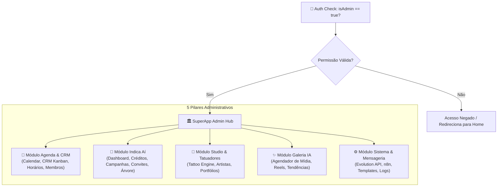
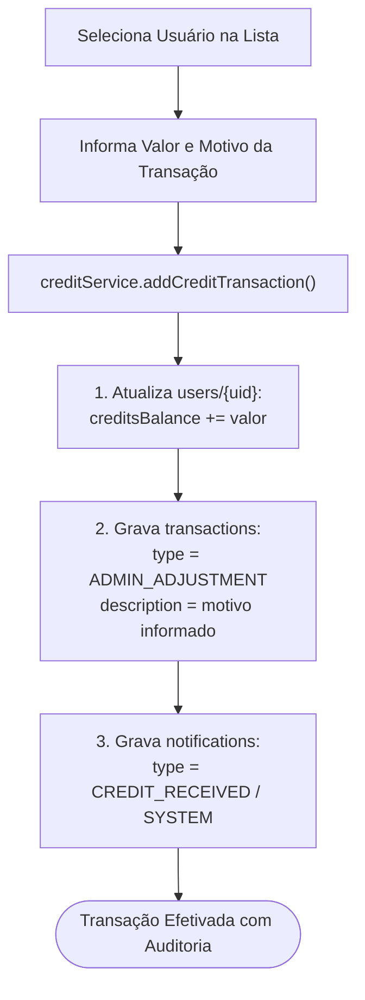

# Fluxograma — Painel Admin & Configurações (Somos 1 / Indica Aí)

> Gerado pelo Reversa Archaeologist em 2026-10-03 (Nível: Detalhado)
> Escala de Confiança: 🟢 CONFIRMADO (Extraído de `src/pages/Admin.tsx`, `src/types.ts`)

---

## 1. Arquitetura Modular do Painel Administrativo

O painel centraliza todas as operações do estúdio com isolamento por `ModuleErrorBoundary`:

---

## 2. Fluxo de Ajuste e Auditoria de Créditos Manuais

