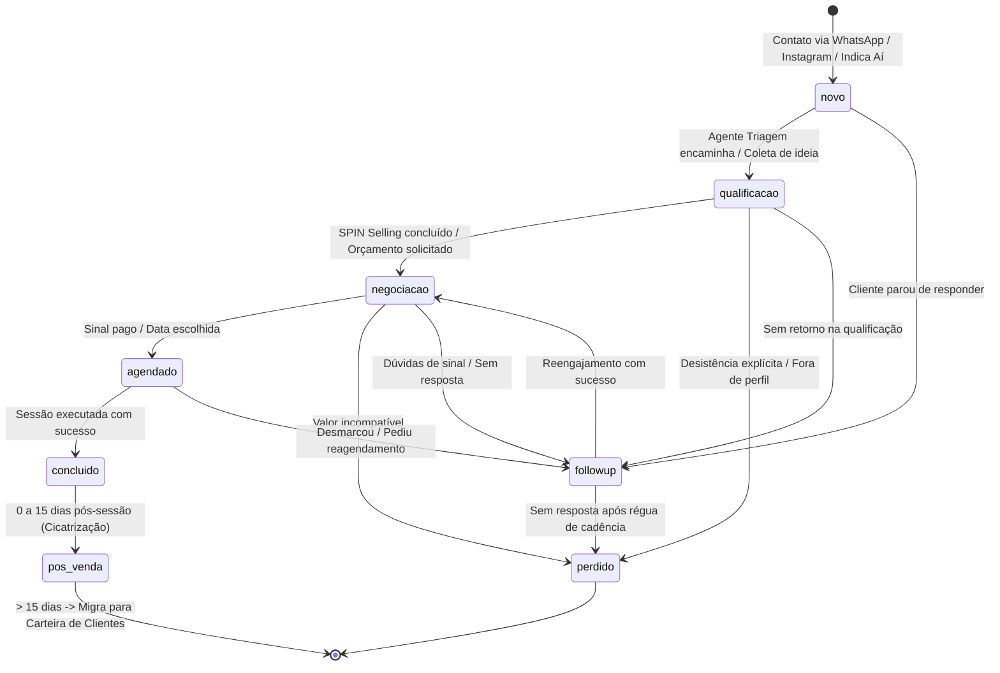
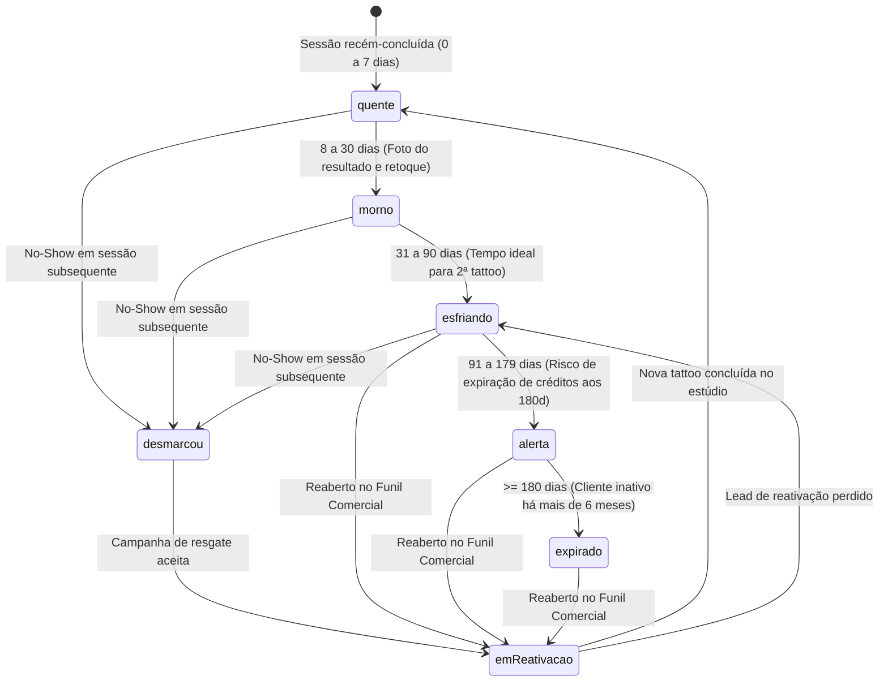
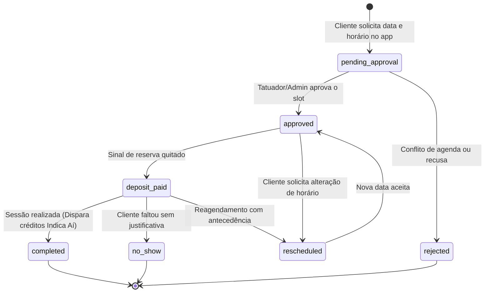
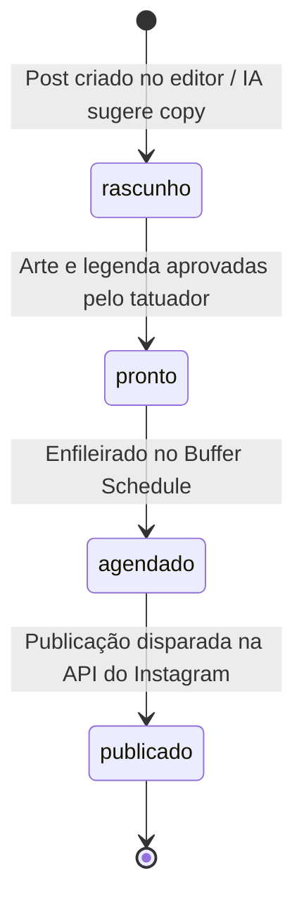

# Máquinas de Estado — SuperApp Somos 1 / Indica Aí

> Gerado pelo Reversa Detective em 2026-10-03 (Nível: Detalhado)
> Escala de Confiança: 🟢 CONFIRMADO (Extraído dos tipos e serviços)

---

## 1. Máquina de Estados: `Lead` (Funil Comercial)

Controla o percurso de aquisição de um potencial cliente desde a primeira mensagem até o fechamento.

---

## 2. Máquina de Estados: `ClienteCRM` (Carteira pós-tattoo)

Controla a esteira de retenção e temperatura ao longo dos meses pós-tattoo:

---

## 3. Máquina de Estados: `Booking` (Agenda & Sessões)

---

## 4. Máquina de Estados: `SocialPost` (Galeria & Conteúdo Social)

